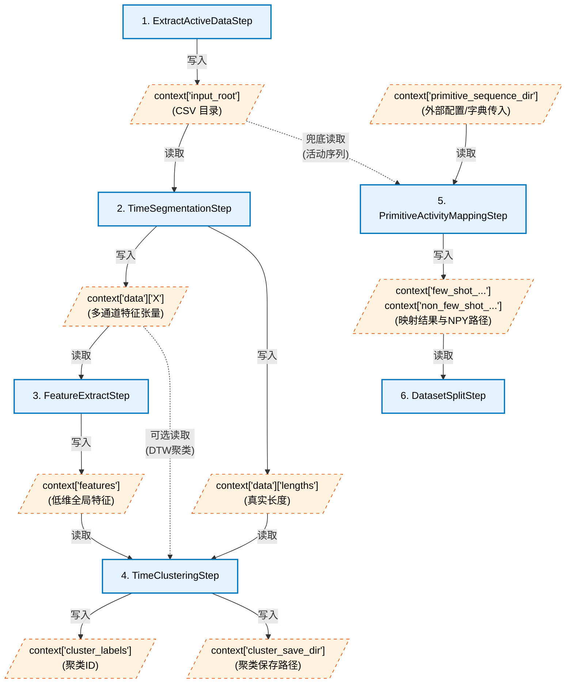

# PSLG-NILM 项目工作流流程

本文档基于 [main.py](file:///home/scnu2023024258/data/code/PSLG-NILM/main.py) 的逻辑，展示了项目的主要工作流执行流程及各步骤间的数据交互详情。

## 核心流程图

```mermaid
graph LR
    subgraph Initialization [初始化阶段]
        Start([开始]) --> LoadConfig[读取配置文件 config.yaml]
        LoadConfig --> InitWF[初始化 Workflow 对象]
    end

    subgraph StepsExecution [步骤执行阶段]
        InitWF --> Step1{是否启用 ExtractActiveData?}
        Step1 -->|是| EAD[ExtractActiveDataStep<br/>提取活动数据]
        Step1 -->|否| Step2
        
        EAD -- "CSV文件列表" --> Step2{是否启用 TimeSegmentation?}
        Step2 -->|是| TS[TimeSegmentationStep<br/>时间序列分割]
        Step2 -->|否| Step3
        
        TS -- "X: (N, L, 4)<br/>lengths: (N, 1)" --> Step3{是否启用 FeatureExtract?}
        Step3 -->|是| FE[FeatureExtractStep<br/>特征提取]
        Step3 -->|否| Step4
        
        FE -- "features: (N, D)" --> Step4{是否启用 TimeClustering?}
        Step4 -->|是| TC[TimeClusteringStep<br/>时间聚类与 T-SNE 可视化]
        Step4 -->|否| Step5
        
        TC -- "cluster_labels: (N,)" --> Step5{是否启用 PrimitiveActivityMapping?}
        Step5 -->|是| PAM[PrimitiveActivityMappingStep<br/>原始活动映射]
        Step5 -->|否| Step6
        
        PAM -- "Activity Tensors" --> Step6{是否启用 DatasetSplit?}
        Step6 -->|是| DS[DatasetSplitStep<br/>数据集切分]
        Step6 -->|否| RunWF
        
        DS --> RunWF[执行 Workflow.run]
    end

    RunWF --> End([结束])

    %% 样式定义
    style Start fill:#f9f,stroke:#333,stroke-width:2px
    style End fill:#f9f,stroke:#333,stroke-width:2px
    style InitWF fill:#bbf,stroke:#333,stroke-width:2px
    style RunWF fill:#bfb,stroke:#333,stroke-width:2px
    style EAD fill:#fff,stroke:#333
    style TS fill:#fff,stroke:#333
    style FE fill:#fff,stroke:#333
    style TC fill:#fff,stroke:#333
    style PAM fill:#fff,stroke:#333
    style DS fill:#fff,stroke:#333
```

    
## 数据流向与格式详解
    
工作流通过一个共享的 `context` 字典传递数据，各步骤通过读取和写入 `context` 中的特定键位实现解耦与数据流转。以下是每个步骤对 `context` 的具体操作与维护的中间变量详情：
    
### Context 变量传递数据流图
    

    
### 1. ExtractActiveDataStep (数据提取)
*   **读取 Context 变量**：
    *   `context.get("appliance_name")` (可选)：电器名称。
*   **写入 Context 变量**：
    *   `context['data']['extract_active_data']['segments_dir']`：输出片段所在的目录路径。
    *   `context['data']['extract_active_data']['segment_files']`：生成的 CSV 路径列表。
    *   `context['input_root']`：设置为 `segments_dir`，作为下游步骤的默认输入目录（若 `set_input_root=True`）。

### 2. TimeSegmentationStep (时间序列分割)
*   **读取 Context 变量**：
    *   `context['input_root']`：输入目录（优先使用），通常由上一环节提供。
    *   `context['log_root']`：用于兜底查找输入或设置当前日志目录。
*   **写入 Context 变量**：
    *   `context['data']['X']` (`np.ndarray`, Shape: `(n_samples, max_len, 4)`)：填充对齐后的多通道样本张量（通道分别为：原始、清洗、低频、高频）。
    *   `context['data']['lengths']` (`np.ndarray`, Shape: `(n_samples, 1)`)：每个样本切片在补 0 前的真实长度。

### 3. FeatureExtractStep (特征提取)
*   **读取 Context 变量**：
    *   `context['data']['X']`：上游提供的时间序列张量数据（优先于外部文件配置）。
*   **写入 Context 变量**：
    *   `context['features']` (`np.ndarray`, Shape: `(n_samples, latent_dim)`)：提取后的低维全局特征向量。
    *   `context['feature_extract_config']` (`dict`)：保存了本次特征提取的配置与训练历史信息（如 loss, model_name 等）。

### 4. TimeClusteringStep (时间聚类)
*   **读取 Context 变量**：
    *   `context['features']`：常规聚类算法所需的特征向量。
    *   `context['data']['X']`：当使用基于 DTW 的聚类时的时序张量。
    *   `context['data']['lengths']` 或 `context['seq_len']`：真实的序列长度，辅助聚类距离计算。
*   **写入 Context 变量**：
    *   `context['cluster_labels']` (`np.ndarray`)：样本对应的聚类 ID（`-1` 表示噪声）。
    *   `context['cluster_save_dir']` (`str`)：聚类结果和图表的保存目录。
    *   `context['n_clusters']` (`int`) 和 `context['n_noise']` (`int`)：有效簇数量和噪声点数量。
    *   `context['evaluation_metrics']` / `context['clustering_metrics']` (`dict`)：聚类评价指标（如轮廓系数等）。
    *   **网格搜索相关**（当进行超参扫描时）：`context['dbscan_scan_best_eps']`, `context['kmeans_scan_best_k']`。*(注：为节省内存，scan 模式下的详细记录 scan_records 仅保存到磁盘，不再存入 context)*。

### 5. PrimitiveActivityMappingStep (原始活动映射)
*   **读取 Context 变量**：
    *   `context['activity_sequence_dir']` 或 `context['input_root']`：活动序列 CSV 的来源目录。
    *   `context['primitive_sequence_dir']`：原始片段来源目录。
*   **写入 Context 变量** (优化后仅保留路径与核心元数据，移除冗余 List 和 DataFrame)：
    *   **元数据路径**：
        *   `context['activity_sequence_source_dir']`, `context['primitive_sequence_source_dir']`：源路径。
    *   **区间与匹配信息** (仅保留 JSON 路径)：
        *   `context['activity_sequence_ranges_json']`：活动区间 JSON 路径。
        *   `context['primitive_sequence_ranges_json']`：原始片段区间 JSON 路径。
        *   `context['primitive_activity_mapping_json']`：两者匹配关系的映射表 JSON 路径。
    *   **最终数据集 (Few-shot 与 Non-few-shot)**：
        *   `context['few_shot_activity_sequences_json']` 和 `context['non_few_shot_activity_sequences_json']`：对应集合的元数据 JSON 路径。
        *   `context['few_shot_activity_seq_lens']` / `context['non_few_shot_activity_seq_lens']`：长度数组。
        *   `context['few_shot_activity_tensor_npy']` / `context['non_few_shot_activity_tensor_npy']`：保存到磁盘的 `.npy` 文件绝对路径。

### 6. DatasetSplitStep (数据分割)
*   **读取 Context 变量**：
    *   `context['raw_series_path']` 和 `context['mains_series_path']`：原始支路和主路的总序列。
    *   `context['few_shot_activity_tensor_npy']` 和 `context['non_few_shot_activity_tensor_npy']`：用于划分的片段张量文件路径。
    *   `context['few_shot_activity_sequences_json']` 和 `context['non_few_shot_activity_sequences_json']`：用于指导分割逻辑的区间信息。
*   **写入 Context 变量**：
    *   `context['dataset_split_summary']` (`dict`)：切分结果的全局统计信息。
    *   `context['dataset_split_summary_json']` (`str`)：切分统计信息落盘的 JSON 路径。
    *   `context['dataset_split_outputs']` (`dict`)：各个生成的切分文件（如 `train_branch.npy`, `test_mains.npy` 等）的最终磁盘路径。
